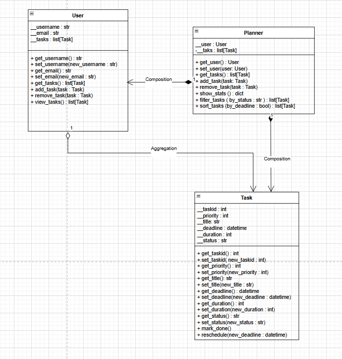

# 📚 Smart Study Planner

### 🎯 Object-Oriented Python Application for Task & Study Management

Smart Study Planner is a **UML-driven**, modular Python project designed with advanced **Object-Oriented Programming (OOP)** principles and **Design Patterns**.
It allows users to create, organize, and track study tasks efficiently using structured classes like **Task**, **User**, and **Planner**.

---

## 🧩 Features

* 🧠 **OOP Design:** Encapsulation, Aggregation, and Composition applied in class design
* 📋 **Task Management:** Create, filter, sort, and track study tasks
* 📊 **Statistics:** View completion rate and performance summary
* ⚙️ **Design Pattern Ready:** Built to integrate Strategy, Observer, and Singleton patterns
* 🧱 **Modular Architecture:** Scalable codebase structured into packages (core, data, ui, etc.)

---

## 🏗️ Class Architecture (UML Overview)


## 🧩 UML Class Diagram

Below is the complete UML class structure of the Smart Study Planner system, representing the relationships between Task, User, and Planner classes.

<p align="center">
  
</p>


## 🧪 Tech Stack

| Category    | Technology                  |
| ----------- | --------------------------- |
| Language    | Python 3.12                 |
| Paradigm    | Object-Oriented Programming |
| Design      | UML, SOLID, Design Patterns |
| Planned GUI | PyQt5                       |
| Database    | SQLite (future integration) |

---

## 🚀 Getting Started

### 1️⃣ Clone the Repository

```bash
git clone https://github.com/AvciDogukan/SmartStudyPlanner.git
cd SmartStudyPlanner
```

### 2️⃣ Run the Project

```bash
python main.py
```

---

## 🧑‍💻 Author

**Doğukan Avcı**
Electrical & Electronics Engineer • Embedded Systems • Robotics • AI • Software Architecture

💎 [GitHub](https://github.com/AvciDogukan)
📧 [dogukan@example.com](mailto:dogukan@example.com)

---

## 🏁 Project Roadmap

* ✅ UML Design & Core OOP Classes
* 🔄 Implement Design Patterns (Strategy, Observer)
* ⏳ Add SQLite Integration
* 🦩 Develop PyQt5 UI Interface
* 🚀 Deploy Final Version with Documentation

---

### 🏷️ License

This project is licensed under the **MIT License** — you are free to use and modify it.
